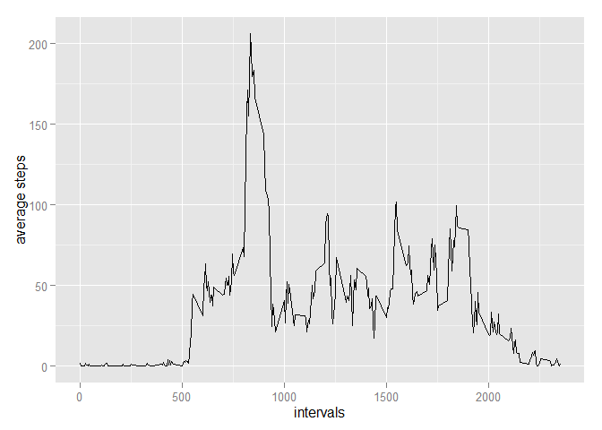
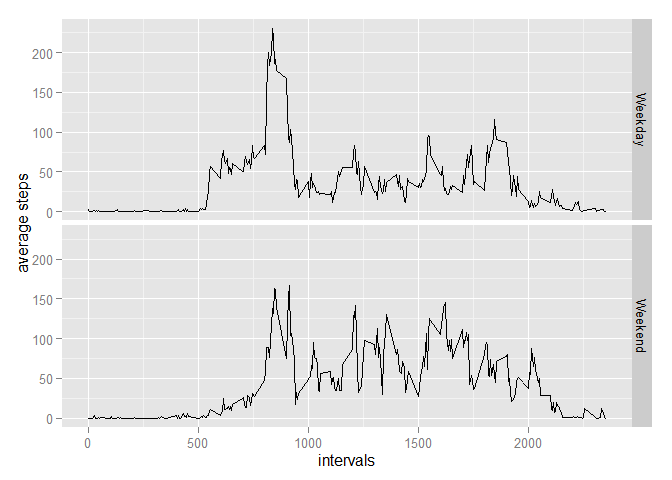

# Reproducible Research: Peer Assessment 1


## Loading and preprocessing the data

1. Load the data into a object called activity   


```r
read.csv("activity.csv") -> activity
```


2. Process/transform the data (if necessary) into a format suitable for your analysis.  

I only need to adjust the class of the column date from now


```r
as.Date(activity$date) -> activity$date
```
 
## What is mean total number of steps taken per day?

1. Calculate the total number of steps taken per day


First, I loaded the plyr package for helping me to calculate the total number, since it is simpler than the split aplay method.

Then I counted the total steps number. Note: Iremove the missing values, because the assingment says to ignore for know.


```r
library(plyr)
ddply(activity, ~ date,summarise, step.total = sum(steps, na.rm= TRUE)) -> total
```

2. Make a histogram of the total number of steps taken each day

I used the ggplot2 package ande the sclae package for making this histrogram


```r
library(ggplot2)
library(scales)
p <- ggplot(total, aes( x = date, y = step.total))
p +geom_histogram( stat= "identity")+ xlab("Date") + ylab("Total number of steps")+ ggtitle("Histogram of the total number os steps taken each day")+scale_x_date(breaks=date_breaks(width="15 days"))
```

 


3. Calculate and report the mean and median of the total number of steps taken per day


```r
summary(total[,2])[3:4]
```

```
## Median   Mean 
##  10400   9354
```

## What is the average daily activity pattern?


1. Make a time series plot (i.e. type = "l") of the 5-minute interval (x-axis) and the average number of steps taken, averaged across all days (y-axis)


```r
ddply(activity, ~interval,summarise, avg.step = mean(steps,na.rm=T)) -> time
ggplot(time, aes(interval, avg.step)) + geom_line()+ xlab("intervals") + ylab("average steps")
```

 


2.Which 5-minute interval, on average across all the days in the dataset, contains the maximum number of steps?


```r
time[which.max(time$avg.step),][1] -> a1
```

Answer: 835 inteval

## Imputing missing values
 
1. Calculate and report the total number of missing values in the dataset (i.e. the total number of rows with NAs)


```r
sum(is.na(activity$step)) -> a2
```


Answer: 2304

2. Devise a strategy for filling in all of the missing values in the dataset. The strategy does not need to be sophisticated. For example, you could use the mean/median for that day, or the mean for that 5-minute interval, etc.  

3. Create a new dataset that is equal to the original dataset but with the missing data filled in.


The strategy is using the mean for that 5-minute interval to subsitute all missing values in the dataset


```r
activity -> activity2
for(i in 1:nrow(activity2)) {
        
        if(is.na(activity2[i,1])) {    
                which(activity2[i,3] == time[,1]) -> n
                activity2[i,1] <- time[n,2]
                                    }
                              }
```


4.Make a histogram of the total number of steps taken each day and Calculate and report the mean and median total number of steps taken per day. Do these values differ from the estimates from the first part of the assignment? What is the impact of imputing missing data on the estimates of the total daily number of steps?


```r
as.Date(activity2$date) -> activity2$date
ddply(activity2, ~date,summarise, step.total = sum(steps,na.rm=T)) -> total2
p <- ggplot(total2, aes( x = date, y = step.total))
p +geom_histogram( stat= "identity")+ xlab("Date") + ylab("Total number of steps")+ ggtitle("Histogram of the total number os steps taken each day")+scale_x_date(breaks=date_breaks(width="15 days"))
```

 

The values are almost the same are diferent as we can see here:


```r
summary(total2[,2])[3:4] -> a3

summary(total[,2])[3:4] -> a4

## with missing values

print(a4)
```

```
## Median   Mean 
##  10400   9354
```

```r
## without missing values
print(a3)
```

```
## Median   Mean 
##  10770  10770
```


## Are there differences in activity patterns between weekdays and weekends?

1. Create a new factor variable in the dataset with two levels - "weekday" and "weekend" indicating whether a given date is a weekday or weekend day.


```r
weekdays(activity2$date) -> day
for(i in 1:length(day)){
       
        if(any(day[i] == c("Monday","Tuesday","Wednesday","Thursday","Friday"))) {day[i] <- "Weekday"                
        }else{ day[i] <- "Weekend"}
}

factor(day) -> day
cbind(activity2,day) -> acweek
```


2. Make a panel plot containing a time series plot (i.e. type = "l") of the 5-minute interval (x-axis) and the average number of steps taken, averaged across all weekday days or weekend days (y-axis).


```r
ddply(acweek, day ~ interval,summarise, avg.step = mean(steps,na.rm=T)) -> time2
ggplot(time2, aes(interval, avg.step)) + geom_line()+ xlab("intervals") + ylab("average steps")+facet_grid(day ~ .)
```

 

The end.


